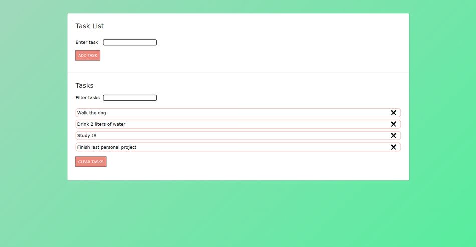

# Responsive to-do list with localStorage
[Live project](https://isaacmyfirsttodolist.netlify.app)

## Table of contents

  - [Overview](#overview)
    - [The project](#the-project)
    - [Links](#links)
  - [My process](#my-process)
    - [Built with](#built-with)
    - [Continued development](#continued-development)

## Overview

### The project

A simple to-do list project, where I can practice my JS skills, along side with what I have recently learned, localStorage.

### Links

- [Live project](https://isaacmyfirsttodolist.netlify.app)

## My process

### Built with

- Mobile-first workflow
- Semantic HTML5 markup
- CSS custom properties
- Flexbox
- JavaScript

### Continued development

It was great to finish this project! Before, I feared localStorage, because I thought it would be hard to deal with it. However, while coding this project, I realized that it was quite easy to manipulate data stored locally. 

